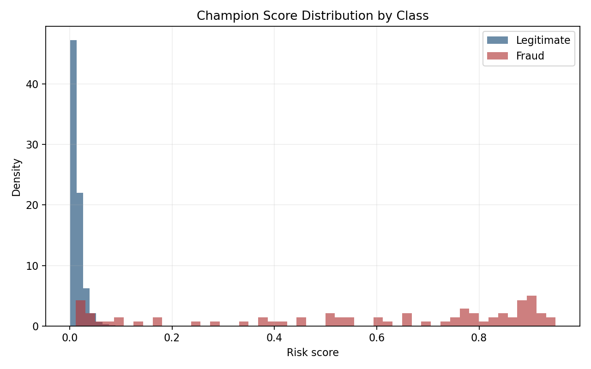
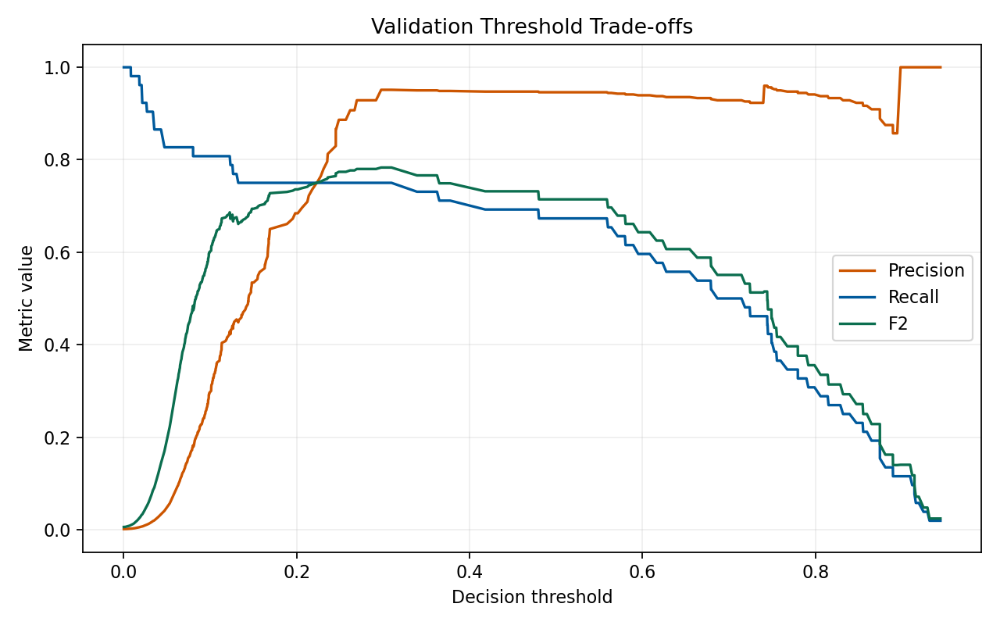
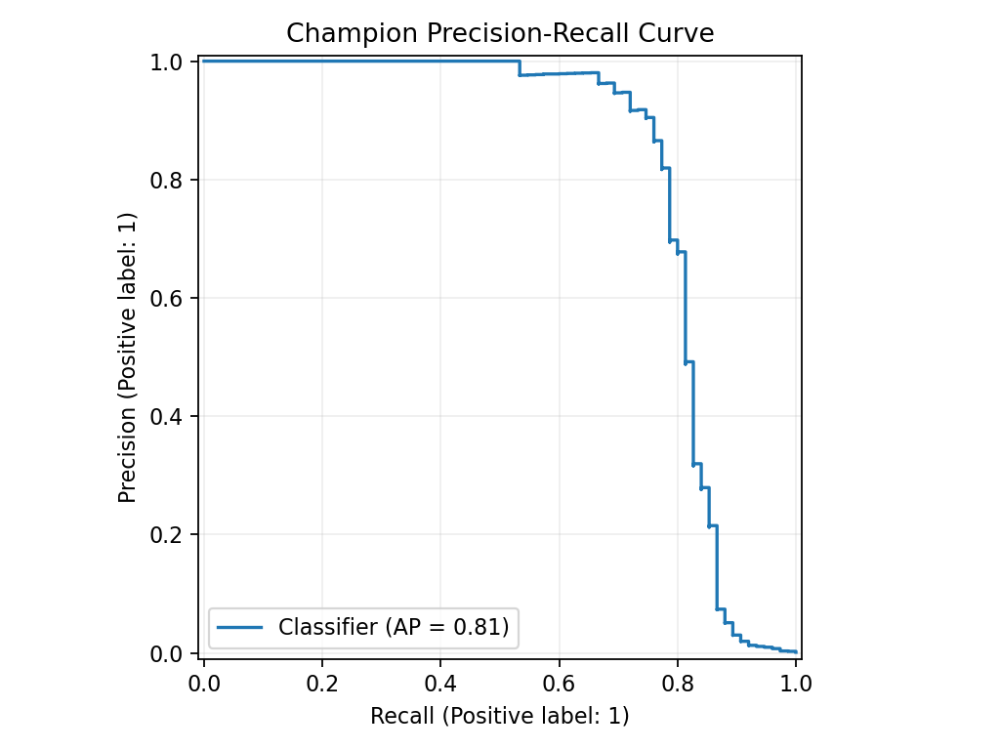
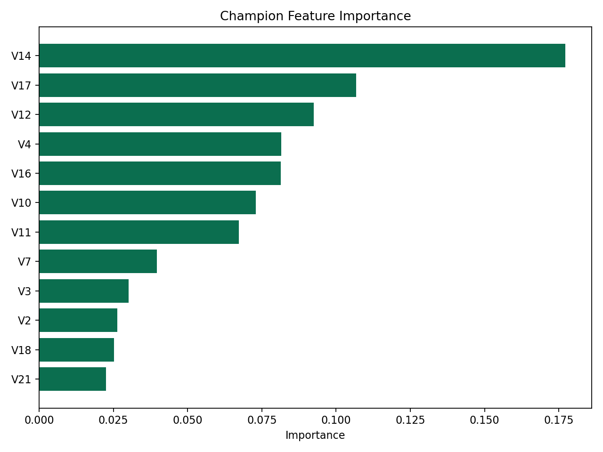
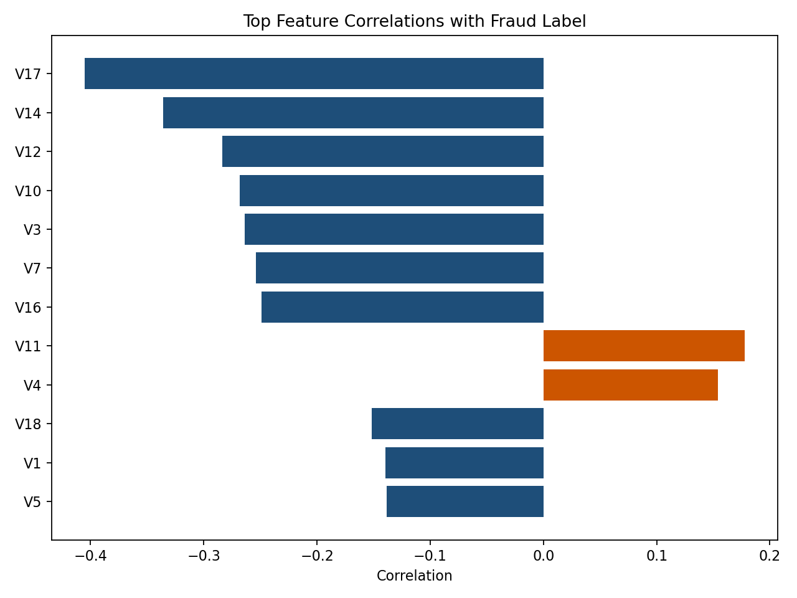
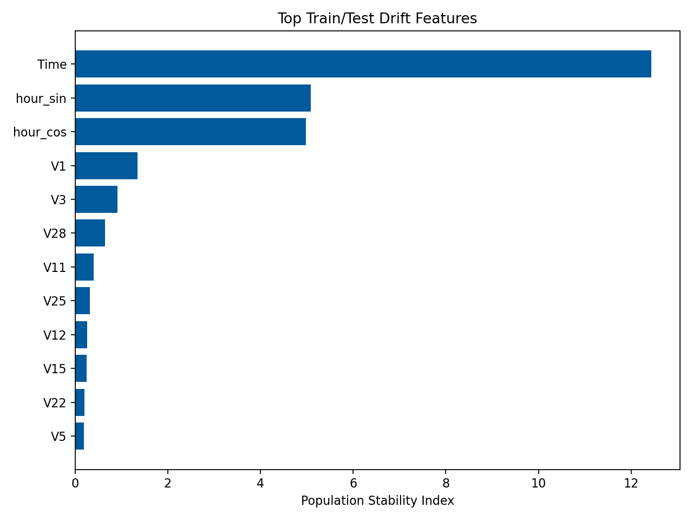
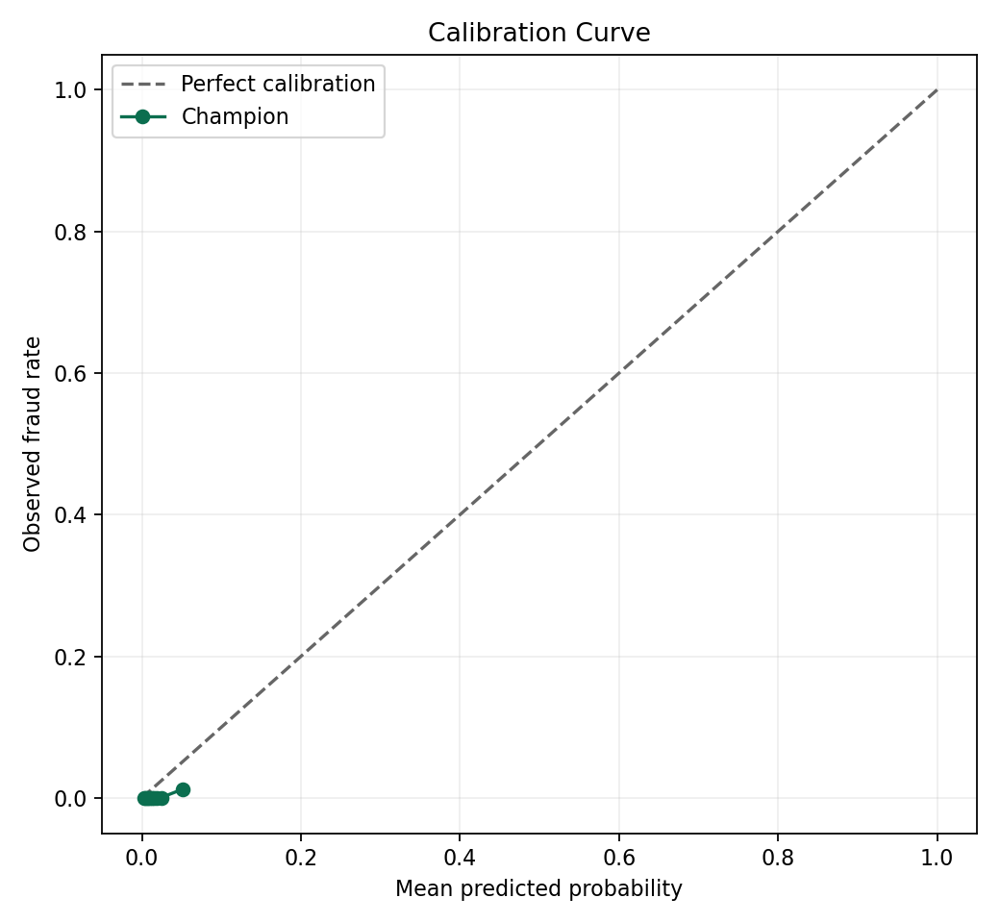
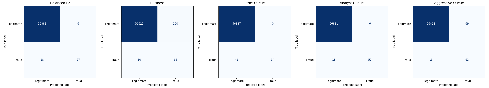

# Fraud Sentinel

Fraud Sentinel is an end-to-end credit-card fraud detection system built as a reproducible ML pipeline rather than a one-off notebook. It uses the public ULB credit-card fraud dataset and frames fraud detection as two linked problems:

- ranking transactions by fraud risk under extreme class imbalance
- converting those scores into operational alert queues with explicit precision, recall, and review-cost tradeoffs

The project combines model development, imbalance-strategy benchmarking, bounded hyperparameter tuning, threshold policy design, diagnostic reporting, and deployable inference surfaces through a CLI, Flask API, and Streamlit dashboard.

## What this project demonstrates

This codebase is designed to make the ML reasoning visible:

- imbalanced classification under a fraud rate of roughly `0.17%`
- leakage-aware evaluation through a chronological holdout split
- comparison of weighting, oversampling, balanced bagging, and undersampling strategies
- separation of ranking quality from deployable threshold quality
- bounded model search with deterministic search spaces and holdout-safe selection logic
- calibration, drift, error analysis, and explainability artifacts
- packaging of the final champion into reusable inference interfaces

## Current trained state

Latest validated full-data CPU run:

| Item | Value |
| --- | --- |
| Champion | `random_forest` |
| Model family | `tree_ensemble` |
| Imbalance strategy | `class_weight` |
| Holdout average precision | `0.812` |
| Holdout ROC AUC | `0.981` |
| Holdout precision | `0.905` |
| Holdout recall | `0.760` |
| Holdout F2 | `0.785` |
| Holdout Brier score | `0.00077` |
| Validation threshold used for `balanced_f2` | `0.3097` |
| Test alert count at `balanced_f2` | `63` of `56,962` transactions |

Top supervised challengers in the current run:

| Rank | Strategy | Imbalance handling | Validation AP | Validation F2 | Test AP | Test F2 |
| --- | --- | --- | --- | --- | --- | --- |
| 1 | `random_forest` | `class_weight` | `0.741` | `0.783` | `0.812` | `0.785` |
| 2 | `smote_random_forest` | `smote` | `0.745` | `0.774` | `0.805` | `0.795` |
| 3 | `balanced_random_forest` | `balanced_bootstrap` | `0.744` | `0.760` | `0.804` | `0.764` |
| 4 | `weighted_logistic_regression` | `class_weight` | `0.776` | `0.757` | `0.750` | `0.732` |
| 5 | `smote_logistic_regression` | `smote` | `0.777` | `0.751` | `0.799` | `0.769` |
| 6 | `nearmiss_logistic_regression` | `nearmiss` | `0.025` | `0.130` | `0.046` | `0.197` |

The project also keeps `isolation_forest` as a separate anomaly-detection baseline. Its very weak precision-recall behavior is useful as a contrast point: in this dataset, a purely unsupervised anomaly detector is not competitive with supervised fraud models.

## Pipeline overview

### 1. Data ingestion and split design

The dataset is sorted by `Time` and split into:

- `64%` train
- `16%` validation
- `20%` test

This is deliberately stricter than random shuffling because fraud systems operate forward in time. The validation split is used for model and threshold selection. The test split is untouched until the final holdout evaluation.

Class balance remains extremely skewed throughout:

| Split | Rows | Fraud cases | Fraud rate |
| --- | --- | --- | --- |
| Full dataset | `284,807` | `492` | `0.173%` |
| Train | `182,276` | `365` | `0.200%` |
| Validation | `45,569` | `52` | `0.114%` |
| Test | `56,962` | `75` | `0.132%` |



### 2. Feature pipeline

The base dataset contains `Time`, `Amount`, anonymized components `V1` to `V28`, and `Class`. The project keeps the original anonymized features and adds lightweight operational features derived from time, such as cyclical hour encodings and day index, so the model can exploit temporal patterns without depending on entity graphs or external enrichment.

The pipeline keeps feature generation explicit and reusable so the same transformations are shared across training, CLI scoring, API inference, and dashboard scoring.

### 3. Imbalance-strategy benchmark

Fraud Sentinel treats imbalance handling as a benchmark dimension, not as a hidden implementation detail. Each challenger is a full strategy bundle with feature prep, sampling or weighting logic, estimator, and metadata.

Current supervised challengers:

- weighted logistic regression
- weighted random forest
- balanced random forest
- SMOTE + logistic regression
- SMOTE + random forest
- NearMiss + logistic regression

This setup makes several comparisons visible:

- cost-sensitive learning vs synthetic oversampling
- linear vs tree-based decision boundaries
- practical deployment contenders vs instructive but weaker baselines
- ranking strength vs thresholded operational performance

The NearMiss baseline is included intentionally as a teaching challenger. Its poor results show that aggressive undersampling can preserve recall while destroying usable precision and ranking quality.

### 4. Controlled tuning

The main deployable supervised challengers are tuned with bounded `RandomizedSearchCV` on the training split only. Search spaces are intentionally small and deterministic, and the scoring objective is aligned with imbalanced detection rather than accuracy.

Tuned strategies:

- `weighted_logistic_regression`
- `random_forest`
- `balanced_random_forest`
- `smote_logistic_regression`

Examples from the latest run:

- best `random_forest` search score: `0.827`
- selected params: `n_estimators=200`, `max_depth=10`, `min_samples_leaf=1`
- best `smote_logistic_regression` search score: `0.760`
- best `weighted_logistic_regression` search score: `0.729`

### 5. Model selection and threshold policy

Fraud detection is not solved by producing a probability alone. This project explicitly separates:

- ranking quality: average precision, ROC AUC
- operating point quality: precision, recall, F1, F2, analyst queue size, fraud amount captured, review cost, business score

The champion is selected by the highest validation `F2` at the `balanced_f2` threshold profile. Thresholds are chosen on the validation split and then frozen before applying them to test data.

Named threshold profiles:

- `balanced_f2`
- `business`
- `strict_queue`
- `analyst_queue`
- `aggressive_queue`

This gives the same trained model multiple deployment modes depending on review capacity and false-positive tolerance.



## Results and interpretation

### Champion behavior on the holdout test set

At the default `balanced_f2` operating point, the champion `random_forest` produced:

- `57` true positives
- `6` false positives
- `18` false negatives
- `56,881` true negatives
- precision `0.905`
- recall `0.760`
- F2 `0.785`

This is a strong operating point for such an imbalanced problem because the model captures most fraud cases while generating only `63` alerts across nearly `57k` transactions.

At other threshold profiles, the same model shifts behavior in a controlled way:

| Profile | Threshold | Alerts | Precision | Recall | F2 |
| --- | --- | --- | --- | --- | --- |
| `strict_queue` | `0.7499` | `34` | `1.000` | `0.453` | `0.509` |
| `balanced_f2` | `0.3097` | `63` | `0.905` | `0.760` | `0.785` |
| `business` | `0.0801` | `325` | `0.200` | `0.867` | `0.520` |
| `aggressive_queue` | `0.1304` | `131` | `0.473` | `0.827` | `0.719` |

This threshold ladder is one of the main practical ideas in the project: the model is evaluated not just as a classifier, but as an alert-generation system.

### Ranking performance vs deployable performance

The strongest validation average precision came from `smote_logistic_regression` at `0.777`, while the final champion was `random_forest` because it gave the best deployable `balanced_f2` validation score. This illustrates a central fraud-ML tradeoff:

- the best ranking model is not always the best operational model
- threshold selection changes model usefulness materially
- imbalance strategy choice must be evaluated against the deployment objective, not only a single leaderboard column



### Generalization and overfitting signals

The project reports train/validation/test ranking metrics so overfitting is measurable rather than assumed. For the champion:

- train AP: `0.979`
- validation AP: `0.741`
- test AP: `0.812`

For tree ensembles, this gap is expected and is exactly why the project keeps a separate untouched test split and reports train-vs-validation gaps. The same reporting also shows that some resampling strategies, especially NearMiss, degrade performance enough to make the tradeoff obvious.

### What the diagnostics show

The artifact layer is meant to make the modeling judgment inspectable.

Top target correlations in the current data:

- `V17`: `-0.405`
- `V14`: `-0.336`
- `V12`: `-0.284`
- `V10`: `-0.268`
- `V3`: `-0.264`

Top feature importances for the champion:

- `V14`
- `V17`
- `V12`
- `V4`
- `V16`
- `V10`

This alignment between correlation structure and learned importance gives a useful sanity check that the model is leaning on the same core fraud signals surfaced by the data diagnostics.




The drift report highlights that time-derived features move the most across chronological splits, which is expected in a forward-time evaluation setting. That is useful because it shows the project is exposing temporal instability rather than hiding it behind random shuffling.



Calibration and score distribution diagnostics are also exported because a fraud model that ranks well but is poorly calibrated can still be hard to operate safely:




### Error analysis

Fraud Sentinel exports false-positive and false-negative examples with simple reason codes built from feature z-scores. These are heuristic explanations, not causal ones, but they are useful for model review and analyst communication.

Examples from the current holdout error analysis:

- false positives often show extreme `V14`, `V17`, `V27`, or `V3` signals that resemble known fraud regions
- false negatives include both high-amount misses and low-amount edge cases with weaker latent fraud signatures
- several misses occur late in time, reinforcing why forward-time drift monitoring matters

### Why the current champion makes sense

The final `random_forest` champion is not selected because it wins every metric. It is selected because, on the validation split used for decision-making, it offers the best balance of:

- strong precision at very low alert volumes
- competitive recall
- stable threshold behavior across queue profiles
- better deployment shape than the best pure ranking challenger

That is the intended design philosophy of the project: build a fraud model that can be reasoned about as an operational system, not just as an offline benchmark score.

## Repository layout

```text
.
|-- data/
|   `-- raw/
|       `-- creditcard.csv
|-- examples/
|   |-- sample_transactions.csv
|   `-- sample_transactions_with_labels.csv
|-- src/fraud_sentinel/
|   |-- api.py
|   |-- cli.py
|   |-- config.py
|   |-- dashboard.py
|   |-- data.py
|   |-- evaluation.py
|   |-- features.py
|   |-- inference.py
|   |-- models.py
|   |-- pipeline.py
|   |-- reporting.py
|   `-- tuning.py
|-- tests/
|   |-- conftest.py
|   |-- test_api.py
|   |-- test_features.py
|   |-- test_models_and_tuning.py
|   `-- test_pipeline.py
|-- artifacts/
|   |-- metrics.json
|   |-- leaderboard.csv
|   |-- anomaly_leaderboard.csv
|   |-- tuning_results.csv
|   |-- strategy_comparison.csv
|   |-- class_distribution.csv
|   |-- correlation_summary.csv
|   |-- feature_importance.csv
|   |-- drift_report.csv
|   |-- error_analysis.csv
|   |-- test_predictions.csv
|   |-- model_bundle.joblib
|   `-- figures/
|       |-- precision_recall_curve.png
|       |-- threshold_tradeoffs.png
|       |-- calibration_curve.png
|       |-- score_distribution.png
|       |-- confusion_matrix_profiles.png
|       |-- feature_distribution_comparison.png
|       |-- correlation_summary.png
|       |-- feature_importance.png
|       |-- drift_report.png
|       `-- learning_curve.png
|-- Dockerfile
|-- pyproject.toml
|-- pytest.ini
`-- README.md
```

## Dataset

The project expects the public fraud dataset at `data/raw/creditcard.csv`.

PowerShell download command:

```powershell
New-Item -ItemType Directory -Force data\raw | Out-Null
curl.exe -L -C - https://storage.googleapis.com/download.tensorflow.org/data/creditcard.csv -o data\raw\creditcard.csv
```

The dataset contains:

- `Time`
- `V1` to `V28`
- `Amount`
- `Class`

Most predictive features are anonymized PCA-like components, so this project emphasizes robust modeling, thresholding, diagnostics, and deployment workflow.

## Installation

Option 1, run directly from source:

```powershell
$env:PYTHONPATH = "src"
```

Option 2, install the package:

```powershell
python -m pip install -e .
```

## Training

### Full training

Runs the full strengthened benchmark, including bounded tuning and diagnostics:

```powershell
$env:PYTHONPATH = "src"
python -m fraud_sentinel.cli train
```

### Faster CPU-friendly training

Disables tuning, reduces estimator sizes, and skips the learning-curve diagnostic:

```powershell
$env:PYTHONPATH = "src"
python -m fraud_sentinel.cli train --quick
```

### Useful options

```powershell
$env:PYTHONPATH = "src"
python -m fraud_sentinel.cli train --sample-rows 50000
python -m fraud_sentinel.cli train --skip-tuning
python -m fraud_sentinel.cli train --skip-diagnostics
```

## Inference

### CLI batch scoring

```powershell
$env:PYTHONPATH = "src"
python -m fraud_sentinel.cli predict examples\sample_transactions.csv --output-csv artifacts\predictions.csv
```

Prediction output includes:

- `risk_score`
- `predicted_label`
- `predicted_label_name`
- `threshold_profile`
- `threshold_used`
- `reason_codes`

### Training summary

```powershell
$env:PYTHONPATH = "src"
python -m fraud_sentinel.cli summary
```

### API

```powershell
$env:PYTHONPATH = "src"
python -m fraud_sentinel.api
```

Endpoints:

- `GET /health`
- `GET /metadata`
- `POST /predict`

Example request:

```json
{
  "threshold_profile": "balanced_f2",
  "records": [
    {
      "Time": 0.0,
      "V1": -1.3598071336738,
      "V2": -0.0727811733098497,
      "V3": 2.53634673796914,
      "V4": 1.37815522427443,
      "V5": -0.338320769942518,
      "V6": 0.462387777762292,
      "V7": 0.239598554061257,
      "V8": 0.0986979012610507,
      "V9": 0.363786969611213,
      "V10": 0.0907941719789316,
      "V11": -0.551599533260813,
      "V12": -0.617800855762348,
      "V13": -0.991389847235408,
      "V14": -0.311169353699879,
      "V15": 1.46817697209427,
      "V16": -0.470400525259478,
      "V17": 0.207971241929242,
      "V18": 0.0257905801985591,
      "V19": 0.403992960255733,
      "V20": 0.251412098239705,
      "V21": -0.018306777944153,
      "V22": 0.277837575558899,
      "V23": -0.110473910188767,
      "V24": 0.0669280749146731,
      "V25": 0.128539358273528,
      "V26": -0.189114843888824,
      "V27": 0.133558376740387,
      "V28": -0.0210530534538215,
      "Amount": 149.62
    }
  ]
}
```

### Dashboard

```powershell
$env:PYTHONPATH = "src"
python -m streamlit run src/fraud_sentinel/dashboard.py
```

The dashboard surfaces:

- supervised leaderboard
- anomaly baselines
- resampling strategy comparison
- threshold profiles
- model card
- diagnostics figures
- error analysis preview
- batch scoring UI

## Main artifacts

After training, the main outputs are:

- `artifacts/model_bundle.joblib`
  - serialized champion model, thresholds, feature builder, and stats
- `artifacts/metrics.json`
  - full structured experiment output
- `artifacts/leaderboard.csv`
  - supervised challenger comparison
- `artifacts/anomaly_leaderboard.csv`
  - anomaly baseline comparison
- `artifacts/tuning_results.csv`
  - bounded search results for tuned strategies
- `artifacts/strategy_comparison.csv`
  - compact imbalance-strategy comparison table
- `artifacts/class_distribution.csv`
  - fraud rates by split
- `artifacts/correlation_summary.csv`
  - target correlation summary
- `artifacts/error_analysis.csv`
  - false-positive / false-negative examples by threshold profile
- `artifacts/test_predictions.csv`
  - scored holdout predictions with reason codes

## Testing

Run the automated tests with:

```powershell
C:\Users\enric\anaconda3\python.exe -m pytest -q
```

Current coverage includes:

- feature builder behavior
- strategy factory and tuning helper behavior
- training pipeline artifact generation
- API prediction output

## Notes

- The project keeps the chronological holdout as the source of truth even when it uses CV inside the training split for bounded tuning.
- NearMiss is included as an instructive imbalance baseline, not because it is expected to be a deployable champion.
- The diagnostics layer is generated as artifacts so the project remains pipeline-first instead of notebook-first.
